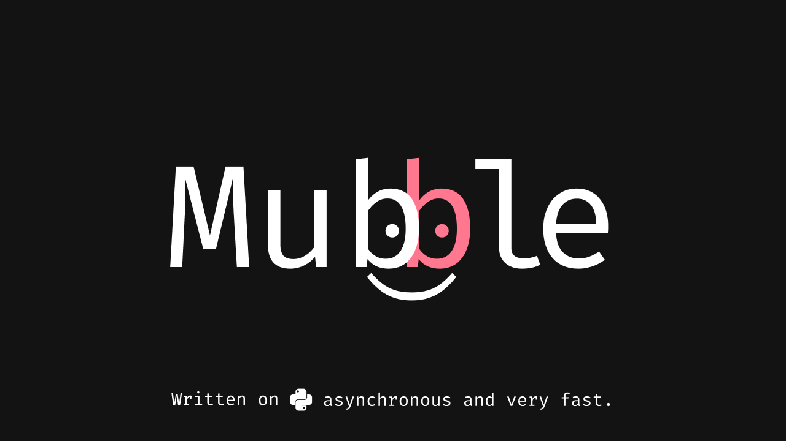

# Mubble 1.2.3 (stable)

[](https://pypi.python.org/pypi/mubble)
[](https://pypi.python.org/pypi/mubble)

[](https://github.com/vladislavkovalskyi/mubble/blob/master/images/mubble_logo.png)

<a href="https://github.com/vladislavkovalskyi/mubble/blob/master/examples">
  
</a>

<br>

**Mubble** is a next-generation framework known for its great speed and simplicity. It is written using aiohttp, asyncio, and msgspec.<br>
*([Author](https://github.com/vladislavkovalskyi)'s words)*
**Make the fastest bot ever!**
<br>

# Getting started

### Installing:
```bash
pip install mubble
```

```bash
poetry add mubble
```

```bash
poetry add git+https://github.com/vladislavkovalskyi/mubble.git#master
```

### Simple bot example:
```python
import random

from mubble import Token, API, Mubble, Message, CallbackQuery
from mubble.rules import StartCommand, Text, Markup, CallbackData
from mubble.tools.keyboard import InlineKeyboard, InlineButton

api = API(Token("Your token"))
bot = Mubble(api)


class Keyboard:
    menu = (
        InlineKeyboard()
        .add(InlineButton("✍️ Write hello", callback_data="hello"))
        .row()
        .add(InlineButton("🍌 Choice banana", callback_data="banana"))
    ).get_markup()

    back = (
        InlineKeyboard().add(InlineButton("⬅️ Back", callback_data="menu"))
    ).get_markup()


@bot.on.message(StartCommand())
async def start_handler(message: Message):
    await message.answer(
        "👋 Hello, I'm Mubble! How can I help you?\n\n"
        "My available commands:\n"
        "- /start\n"
        "- /menu\n"
        "- /random [from number] [to number]"
    )


@bot.on.message(Text("/menu"))
async def menu_handler(message: Message):
    await message.answer(
        "📃 Here's your menu! Use the keyboard.", reply_markup=Keyboard.menu
    )


@bot.on.message(Markup(["/random", "/random <a:int> <b:int>"]))
async def random_handler(message: Message, a: int = None, b: int = None):
    if None in (a, b):
        await message.answer(
            "🤓 Wrong syntax. You also need to write the first number and the second number."
        )
        return

    await message.answer(f"🎲 Your random number is {random.randint(a, b)}")


@bot.on.callback_query(CallbackData("menu"))
async def menu_handler(cq: CallbackQuery):
    await cq.edit_text(
        "📃 Here's your menu! Use the keyboard.", reply_markup=Keyboard.menu
    )


@bot.on.callback_query(CallbackData("hello"))
async def hello_handler(cq: CallbackQuery):
    await cq.edit_text("👋 Hello, I'm Mubble!", reply_markup=Keyboard.back)


@bot.on.callback_query(CallbackData("banana"))
async def fruits_handler(cq: CallbackQuery):
    await cq.answer("You clicked on the 🍌!")


bot.run_forever()
```

Слава Україні! 🇺🇦


*by Vladyslav Kovalskyi*
