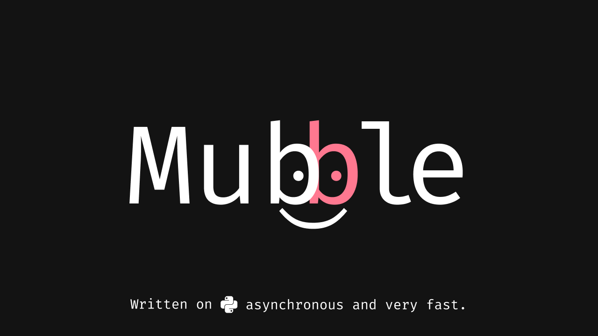

# Middleware (English 🇬🇧)
This example is created to demonstrate how to work with **Middlewares** in **Mubble**.

**Why do you need Middlewares?**<br>
They can be useful when you need to invoke some algorithms **Before** _(pre)_, or **After** _(post)_ your handlers.<br>
For example: You want to register not just when a person types the `/start` command, but when a person is already using the bot and sends any message. Also, using the context, it can immediately send some information (such as the user's object) to the handler, so you don't have to copy and paste the user data retrieval using their `Telegram ID` in different handlers.

* We create a class `Middleware` that inherits from the abstract `ABCMiddleware`.<br>
In our abstract `ABCMiddleware`, there are `pre` and `post` functions that we can override.<br>
The `pre` function will work before the handler is executed, and the `post` function will work after the handler has already executed.<br>
In short: If the `pre` function _(as in our example)_ returns False, the handler's work is blocked. If it returns True, the handler continues to work.<br>
`ctx.set("generated_number", number)` - here we set the key `generated_number` in the context _(which we will later expect in the handler)_, and its value is `number`.

* Next, we call our usual decorator, which responds to `/number`, but the special feature is that our asynchronous function precisely takes our key `generated_number` from the handler.<br>

#### ⚠️ Be careful. If you take this code as a base, remember that our `Middleware` blocks the work of any handlers, as random can return the number `1` !!!

## Code example
In this example, the **Middleware** generates a random number from 1 to 3. If the number is 1, it blocks the work of the handlers, but if the number is 2 or 3, it calmly adds them to the context and our handler catches them.
```python
import random

from mubble import Token, API, Mubble, ABCMiddleware, Message
from mubble.bot import Context
from mubble.rules import Text

api = API(Token.from_env())
bot = Mubble(api)


class Middleware(ABCMiddleware[Message]):
    async def pre(self, event: Message, ctx: Context) -> bool:
        number = random.randint(1, 3)
        if number == 1:
            await event.answer(
                "🖥 Hello! I'm middleware!\n"
                f"Generated number is {number}\n"
                "Unfortunately I blocked your handler because it turned out to be number 1."
            )
            return False
        
        await event.answer(
            "🖥 Hello! I'm middleware!\n"
            f"Generated number is {number}\n"
            "Now this context will be available to you in a handler."
        )
        ctx.set("generated_number", number)
        return True
        


@bot.on.message(Text("/number"))
async def number(m: Message, generated_number: int):
    await m.reply(f"🙄 Your number from middleware is {generated_number}")


bot.on.message.middlewares.append(Middleware())
bot.run_forever()
```

## Example of use

