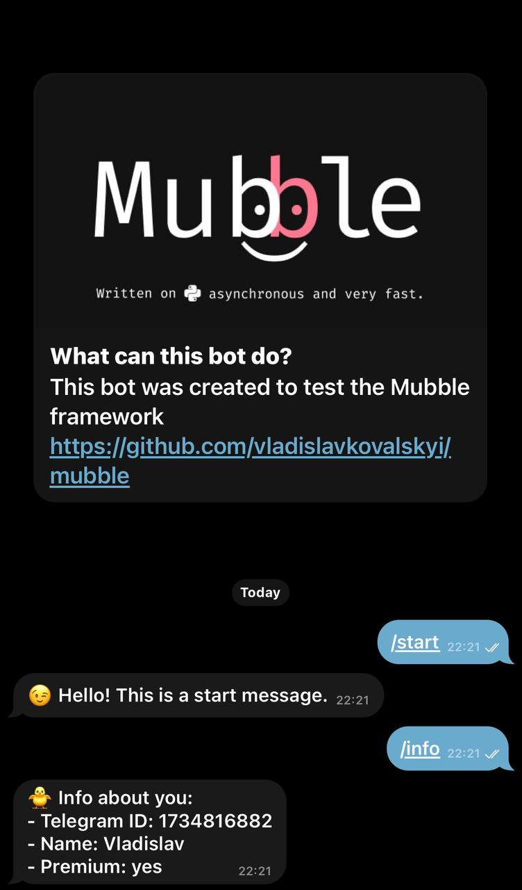

# Dispatch (Ukrainian 🇺🇦)
Цей приклад створений для того, щоб показати як працювати з **Dispatch** в **Mubble**

**Для чого Dispatch потрібен?**<br>
Він вам знадобиться у тому випадку, коли ви захочете зробити гарну структуру вашого бота та розділити всі хендлери по різним файлам/папкам.

## Приклад коду

### Файл: `project/app.py`
У цьому прикладі ми робимо стандартну схему ініціалізації нашого бота, але перед цим ми ініцілізуємо наш клас `Dispatch`, в яким ми будемо завантажувати інші екземпляри з файлів, які у нашому випадку знаходяться у каталозі commands.
```python
from mubble import Dispatch, Token, API, Mubble

from commands import start, info

dispatch = Dispatch()
for b in (start, info):
    dispatch.load(b.dispatch)

api = API(Token.from_env())
bot = Mubble(api, dispatch=dispatch)

bot.run_forever()
```

### Файл: `project/commands/start.py`
У цьому випадку ми ініціалізуємо наш `Dispatcher`. Особливість його полягає в тому, що ви можете ним користуватись точно так, як у випадку з `@bot`

```python
from mubble import Dispatch, Message
from mubble.rules import StartCommand

dispatch = Dispatch()


@dispatch.message(StartCommand())
async def start(message: Message):
    await message.answer("😉 Hello! This is a start message.")
```

### Файл: `project/commands/info.py`
У цьому випадку ми ініціалізуємо наш `Dispatcher`. Особливість його полягає в тому, що ви можете ним користуватись точно так, як у випадку з `@bot`

```python
from mubble import Dispatch, Message
from mubble.rules import Text

dispatch = Dispatch()


@dispatch.message(Text("/info"))
async def info(message: Message):
    await message.answer(
        f"🐥 Info about you:\n"
        f"- Telegram ID: {message.from_user.id}\n"
        f"- Name: {message.from_user.first_name}\n"
        f"- Premium: {'yes' if message.from_user.is_premium else 'no'}"
    )
```

### Файл: `project/commands/__init__.py`
В `__init__.py` файл ми імпортуємо наші файли для того, що ми потім могли спокійно імпортовувати наші файли з папки `commands`
```python
from . import start, info

__all__ = ["start", "info"]
```

## Приклад використання

