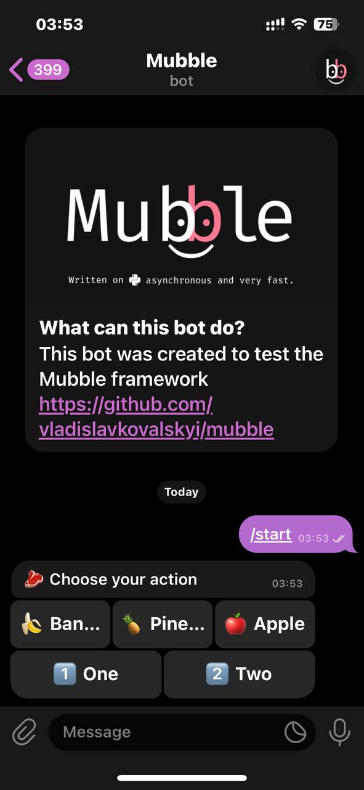
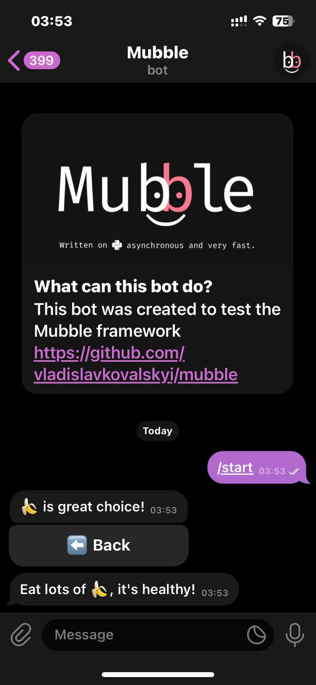
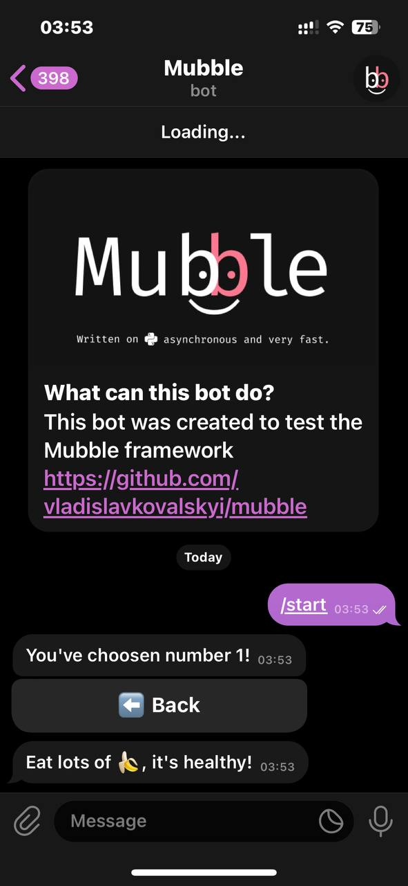
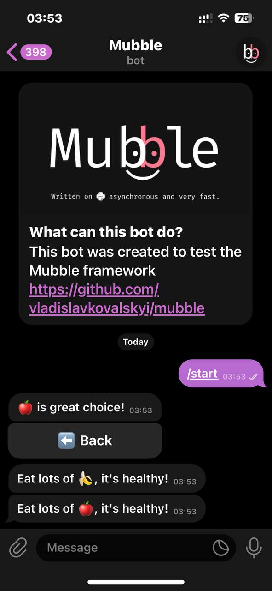

# Image (English 🇬🇧)
This example is created to demonstrate how to work with **keyboards** in **Mubble**.

* Classes `InlineKeyboard` and `InlineButton` are needed to create an Inline keyboard (Inline - keyboards attached to messages).
* Classes `CallbackData` and `CallbackDataMarkup` are required to handle `callback_data` that you've written in the button; it's similar to the rules for `Text` and `Markup` in regular messages.
* Next, we create a class `Keyboard`, where we simply group our keyboards. We use `.add()` to add a button and `.row()` to create a row.
* We set up a handler for the `/start` command, where text is sent, and in the `reply_markup` parameter, we specify our keyboard with fruits.
* In `@bot.on.callback_query`, we can specify our rules using binary operators (| - or; & - and; ~ - not...). With `CallbackData`, we can "react" to regular `callback_data`, just like regular text.
<br>
We see that using `cq: CallbackQuery`, we can perform `.answer`, `.edit_text`, and `cq.ctx_api.send_message`. What does this mean?
<br><br>
`cq.answer` triggers an alert in Telegram, meaning a window pops up with your message.
<br>
`cq.edit_text` edits the message on which you pressed a button on the keyboard.
<br>
`cq.ctx_api.send_message` sends a regular message using the context API, meaning we directly specify that we want to send a message through this Telegram Bot API method. Inside `ctx_api`, there are many methods you can use.
* Next, we specified `CallbackDataMarkup`, which is similar to the regular `Markup`, where you can write your "patterns". After this, information from the message will be passed to the `number` parameter according to our pattern, and then sent.
* Next is the reaction to `callback_data` - `back`, which essentially does the same thing as the `/start` command, but it edits our message and shows a "hint/alert".


## Code example
```python
from mubble import Token, API, Mubble, CallbackQuery, Message
from mubble.tools import InlineKeyboard, InlineButton
from mubble.rules import StartCommand, CallbackData, CallbackDataMarkup

api = API(Token.from_env())
bot = Mubble(api)


class Keyboard:
    fruits = (
        InlineKeyboard()
        .add(InlineButton("🍌 Banana", callback_data="banana"))
        .add(InlineButton("🍍 Pineapple", callback_data="pineapple"))
        .add(InlineButton("🍎 Apple", callback_data="apple"))
        .row()
        .add(InlineButton("1️⃣ One", callback_data="number/1"))
        .add(InlineButton("2️⃣ Two", callback_data="number/2"))
    ).get_markup()

    back = (
        InlineKeyboard()
        .add(InlineButton("⬅️ Back", callback_data="back"))
        .get_markup()
    )

emojis = {"banana": "🍌", "pineapple": "🍍", "apple": "🍎"}


@bot.on.message(StartCommand())
async def start_handler(message: Message):
    await message.answer("🥩 Choose your action", reply_markup=Keyboard.fruits)


@bot.on.callback_query(
        CallbackData("banana")
        | CallbackData("pineapple")
        | CallbackData("apple")
)
async def fruits_handler(cq: CallbackQuery):
    emoji = emojis[cq.data.unwrap()]
    await cq.answer(f"You've choosen {emoji}")
    await cq.ctx_api.send_message(
        cq.message.unwrap().chat.id, f"Eat lots of {emoji}, it's healthy!"
    )
    await cq.edit_text(f"{emoji} is great choice!", reply_markup=Keyboard.back)


@bot.on.callback_query(CallbackDataMarkup("number/<number:int>"))
async def number_handler(cq: CallbackQuery, number: int):
    await cq.edit_text(f"You've choosen number {number}!", reply_markup=Keyboard.back)


@bot.on.callback_query(CallbackData("back"))
async def back_handler(cq: CallbackQuery):
    await cq.answer("You've returned to the menu.")
    await cq.edit_text("🥩 Choose your action", reply_markup=Keyboard.fruits)


bot.run_forever()

```

## Example of use




