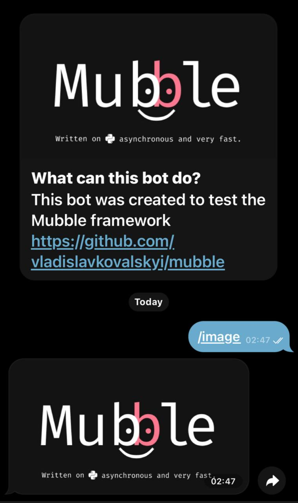

# Image (Ukrainian 🇺🇦)
Цей приклад створений для того, щоб показати як працювати з **файлами** в **Mubble**

* `pathlib`, а конкретно клас `Path` допоможе вам вказати шлях до вашого зображення та дістати з нього байти, тим самим ви зможете зберегти їх у змінну `mubble_image` _(для прикладу)_
* Далі ми викликаємо `Telegram API method`, який називається `send_photo`, що дозволяє відправляти зображення. Головним параметром є `chat_id`, який потрібно передати, щоб бот знав, у який чат відправляти повідомлення, а `photo` приймає два об'єкти: `назва файлу та формат`, `саме зоображення у вигляді байтів` (`filename`, `bytes`)

## Приклад коду для відправки зображення
```python
from mubble import Token, API, Mubble, Message
from mubble.rules import Text

from pathlib import Path

api = API(Token("Ваш токен"))
bot = Mubble(api)

mubble_image = Path("mubble.png").read_bytes()


@bot.on.message(Text("/image"))
async def image(message: Message):
    await api.send_photo(
        chat_id=message.chat.id,
        photo=("image.png", mubble_image),
    )

bot.run_forever()
```

## Приклад використання

